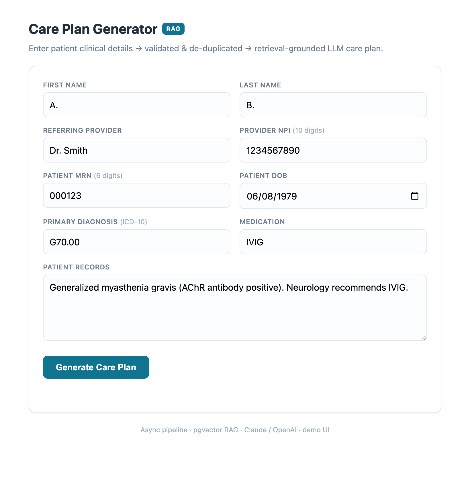
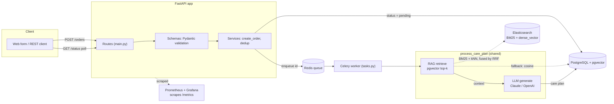
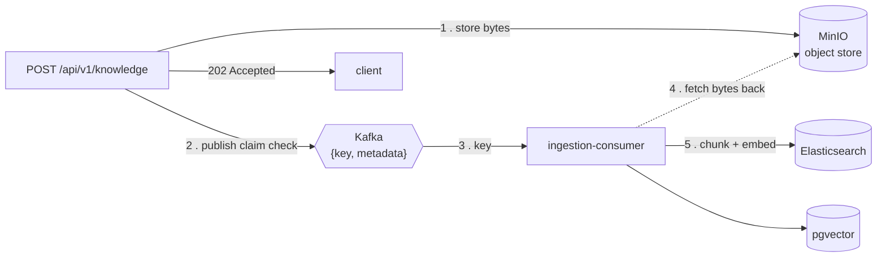
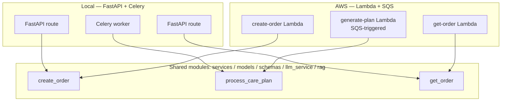

# Care Plan Generator (RAG)

A pharmacist-facing service that turns patient clinical input into a downloadable, **retrieval-grounded** care plan. A clinician submits patient/provider/medication details; the request is validated and de-duplicated, queued for asynchronous processing, enriched with relevant clinical guidelines via **RAG (pgvector + embeddings)**, and generated by an **LLM (Claude / OpenAI)** — then polled for and downloaded.

The same business logic runs **two ways from one codebase**: locally on FastAPI + Celery, and on AWS as Lambda + SQS + RDS (provisioned with Terraform).

> Built as an end-to-end systems project: requirements → API/DB design → async processing → layering → validation & error handling → tests/CI → pluggable adapters & LLM providers → monitoring → cloud deployment & IaC → RAG with quantitative evaluation.

      



---

## Architecture



Uploaded documents take a separate path in, so a multi-MB payload never travels
through the broker — only the object key does:



**Request lifecycle:** `POST` validates input, runs duplicate detection, persists the order as `pending`, enqueues the id, and returns — without waiting on the LLM, which is the whole point: generation takes seconds, so holding a connection open for it would tie up a worker per in-flight request and leave a failure with nowhere to retry. A worker picks up the job, **atomically claims** it (idempotency), retrieves relevant clinical chunks, injects them as context into the LLM, and writes the completed plan back. The frontend polls a lightweight status endpoint until `completed`.

### One codebase, two entry points

The business logic lives once and is reused locally and on AWS — only the *entry point* and *transport* differ.



| Action | Shared logic | Local entry point | AWS entry point |
|---|---|---|---|
| Create order + validate + dedup | `services.create_order` | FastAPI route | `create-order` Lambda |
| Generate care plan | `services.process_care_plan` (atomic claim → retrieve → LLM → write) | Celery worker (`tasks.py`) | `generate-plan` Lambda (SQS-triggered) |
| Read order | `services.get_order` | FastAPI route | `get-order` Lambda |

Key decoupling: **enqueueing** is the entry point's job (local Celery `.delay`, AWS `sqs.send_message`); `services` knows nothing about the transport. The DB driver differs only by `DATABASE_URL` dialect (local `psycopg`, AWS pure-Python `pg8000` — same `db.py`).

---

## Document ingestion: claim-check over Kafka, indexed into Elasticsearch

Knowledge does not only arrive from the seed script. `POST /api/v1/knowledge` accepts an uploaded
document, and that upload deliberately does **not** travel through the message broker.

The problem with putting a file on a queue is that brokers are tuned for small messages; a multi-MB
payload inflates broker memory, slows every consumer that has to deserialize it, and makes a redelivery
expensive. So the pipeline uses the **claim check** pattern:

```
POST /api/v1/knowledge
  -> store the bytes in MinIO (S3-compatible), returning an object key
  -> publish only {object key, metadata} to Kafka          [the "claim check"]
  -> 202 Accepted

ingestion-consumer
  -> read the key from Kafka, fetch the bytes back from MinIO
  -> chunk -> embed
  -> index into Elasticsearch (BM25 text + dense_vector) and pgvector
```

The message stays tiny and the payload lives in object storage, which is what it is good at. Delivery
is **at-least-once**, so the consumer is written to be replay-safe: re-processing the same key
re-indexes the same chunk ids rather than appending duplicates.

### Why both Elasticsearch and pgvector

pgvector alone gives *semantic* search. That is the wrong tool for a clinical corpus on its own,
because drug names, dosages and abbreviations need to match **exactly** — two drug names can be a few
characters apart and mean completely different things, which is precisely where embedding similarity
is weakest.

So retrieval runs two ways and fuses them (see below): Elasticsearch supplies BM25 lexical matching
alongside kNN over a 384-dim `dense_vector`, and pgvector remains as a fallback path so the service
still answers if the Elasticsearch cluster is unavailable — degraded retrieval quality rather than an
outage. `RETRIEVAL_BACKEND` selects which path is active.

## RAG & evaluation

Care plans are **grounded in retrieved clinical guidelines** rather than relying solely on the model's parametric memory — important for accuracy in a clinical context.

- **Vector store:** pgvector (`pgvector/pgvector:pg16` + Alembic migration `0002` creating `knowledge_chunks(embedding vector(384))`) — reuses Postgres, no extra infrastructure.
- **Pluggable embeddings** (`embedding_service.py`, same factory pattern as the LLM layer): `mock` (tests) · `fastembed` (local, real semantics — BAAI/bge-small-en-v1.5, 384-dim) · extensible to Voyage/OpenAI for cloud (Anthropic has no embedding API).
- **Pipeline** (`rag.py`): chunk (with overlap) → embed → store; retrieve via cosine `<=>` top-k → inject into `llm_service.generate(context=...)`. Wired into the shared `services.process_care_plan`, so **both local and AWS paths get RAG for free**.
- **Asymmetric embeddings handled:** queries use an instruction-prefixed `embed_query`, passages use `embed` — bge degrades badly otherwise.

### Two-layer evaluation (the part I'd defend in an interview)

**1. Retrieval** — `eval/eval_retrieval.py`, 11 labeled queries (incl. paraphrases):

| recall@3 | hit@3 | MRR | precision@3 |
|---|---|---|---|
| **1.00** | 1.00 | 0.82 | 0.39* |

\*precision is low by design — most queries have a single relevant doc, so precision@3 caps at ~0.33–0.5. The eval **exits non-zero if recall@3 < 0.80**, so it works as a CI regression gate.

**2. Generation** — `eval/eval_generation.py`, claim-level **NLI-style faithfulness** (decompose plan into atomic clinical claims → label each against retrieved context):

- `SUPPORTED` — directly backed by the guidelines
- `NEUTRAL` — reasonable general knowledge the guidelines don't cover (acceptable)
- `CONTRADICTED` — conflicts with the guidelines (the actual danger)

Run over **20 cases spanning 9 in-scope conditions (11 drugs the KB documents) + 9 adversarial out-of-scope drugs it deliberately doesn't — yielding ~720 atomic claims** (394 in-scope + 324 out-of-scope), so the contradiction rate is a real distribution rather than resting on a handful of claims.

| Metric | Result | Meaning |
|---|---|---|
| **Contradiction rate** | **≈ 0.01** (6 of ~720 claims) | Primary safety signal — the model almost never states anything that conflicts with the guidelines |
| **Grounding coverage** | **0.37 in-scope vs 0.00 out-of-scope** | Doubles as an out-of-scope detector: all 9 drugs absent from the KB score exactly 0.00, which can gate a refuse / low-confidence warning |

**Negative controls (discriminative-power check):** a near-zero contradiction rate only means something if the judge can actually *fire* — a judge that always answers `SUPPORTED`/`NEUTRAL` would also report ~0. So the eval ships **5 planted contradictions** (reversed dose, contraindication called safe, inverted administration instruction, discouraged drug combo) that the judge **must** label `CONTRADICTED` — **all 5 are caught (5/5)**. This proves the ≈0 rate is a working detector, not a broken thermometer.

> The judge is a live LLM, so exact values move a little run-to-run; refresh by re-running `eval.eval_generation` with `LLM_PROVIDER=claude` after seeding. The **0.37-vs-0.00 in-scope/out-of-scope separation and the 5/5 negative controls are the stable, defensible results** — not any single decimal.

> **Design rationale:** this is *augmentation* RAG, not closed-book QA. The model's general clinical knowledge is a feature, not hallucination — so a naïve "every claim must be in the docs" faithfulness score (which conflated good general knowledge with dangerous fabrication) was the wrong KPI. The NLI split separates `NEUTRAL` (fine) from `CONTRADICTED` (unsafe). **Known limitation:** self-judging against the *retrieved* context only catches conflicts-with-retrieved, not factual errors absent from the context — true correctness needs gold answers / expert labels.

```bash
docker compose exec app python -m eval.seed_knowledge                          # load the KB
docker compose exec app python -m eval.eval_retrieval                          # retrieval metrics (free)
docker compose exec -e LLM_PROVIDER=claude app python -m eval.eval_generation  # faithfulness (real LLM judge)
```

---

## Key features

- **Async pipeline** — Redis + Celery; the API accepts and returns immediately instead of blocking on a multi-second LLM call. Horizontally scalable by adding workers.
- **Idempotent processing** — workers claim jobs with an atomic `UPDATE ... WHERE status IN ('pending','failed')` and check the row count, avoiding duplicate processing under concurrency.
- **Layered design** — thin routes (`main.py`) / Pydantic validation (`schemas.py`) / business logic (`services.py`). Decision rule: "if I swapped the web framework, would this change?"
- **Unified error handling & duplicate detection** — one exception hierarchy (`{type, code, message, detail}`) with a single handler; ERROR (block, 409) vs WARNING (confirmable, 200) vs validation (400).
- **Multi-source intake (Adapter pattern)** — `POST /api/v1/intake/{source}` accepts CVS form / clinic JSON / pharma XML, each normalized to one `InternalOrder`; adding a source = one adapter + one factory line.
- **Pluggable, model-agnostic LLM provider (Feature Flag)** — switch between `claude`, `openai`, and `mock` via the `LLM_PROVIDER` env var, no code change. Adding a provider is a subclass + one line in the factory.
- **Monitoring** — Prometheus + Grafana; `/metrics` exposes request/latency/error metrics plus a business counter `care_plans_created_total{source}`.
- **RESTful API** — pagination + filtering, Patient CRUD, Provider creation, care-plan download, retry of failed jobs, with proper status codes (201/204/404/409).
- **Production hardening** — Alembic migrations (versioned schema, no `create_all`), API-key auth on `/api/`, secrets via env (not hard-coded).
- **22 passing tests + CI** — in-memory SQLite + mock LLM/embedder, plus a separate CI job that runs the real retrieval eval against pgvector as a regression gate.

---

## Tech stack

| Layer | Choice |
|---|---|
| API | FastAPI (async), Pydantic v2 |
| Async | Redis queue + Celery (retries + exponential backoff) |
| Data | PostgreSQL + pgvector, SQLAlchemy, Alembic |
| RAG | pgvector, fastembed (bge-small-en-v1.5), pluggable embedder |
| LLM | Anthropic Claude (`claude-sonnet-4-6`) + OpenAI (`gpt-4o-mini`), pluggable via `LLM_PROVIDER`; mock for tests |
| Monitoring | Prometheus + Grafana |
| Packaging | Docker + Docker Compose |
| Cloud | AWS Lambda, SQS (+ DLQ), RDS, API Gateway |
| IaC | Terraform (dedicated VPC, NAT, one-command apply/destroy) |
| CI | GitHub Actions (tests + retrieval-eval gate) |

---

## Project structure

```
care-plan-rag/
├─ careplan/                ← application package (imported as careplan.*)
│  ├─ main.py               Routes (FastAPI entry: request → service → response)
│  ├─ schemas.py            Pydantic models + input validation
│  ├─ services.py           Business logic + duplicate detection + process_care_plan
│  ├─ models.py             SQLAlchemy tables (Patient / Provider / Order / CarePlan)
│  ├─ db.py                 DB connection (engine / session)
│  ├─ exceptions.py         Unified error hierarchy (BaseAppException + subclasses)
│  ├─ adapters.py           Multi-source adapters (JSON/XML → InternalOrder) + factory
│  ├─ internal_order.py     InternalOrder — the internal canonical format
│  ├─ llm_service.py        LLM abstraction (Claude / OpenAI / Mock + factory + Feature Flag)
│  ├─ embedding_service.py  Embedding abstraction (mock / fastembed)
│  ├─ rag.py                Chunk → embed → store → retrieve (pgvector cosine)
│  └─ tasks.py              Celery task (claim → retrieve → LLM → write, with retries)
├─ eval/                    ← RAG evaluation + KB seeding (run via `python -m eval.<name>`)
│  ├─ seed_knowledge.py     Seed the sample clinical knowledge base
│  ├─ eval_retrieval.py     Retrieval eval (recall@k / MRR / hit@k) — CI gate
│  └─ eval_generation.py    Generation eval (NLI claim-level faithfulness)
├─ tests/                   conftest + pytest suite (22 tests)
├─ alembic/                 DB migrations (0001 schema, 0002 pgvector + knowledge_chunks)
├─ aws/                     Lambda handlers + build script (deploy zips are git-ignored)
├─ infra/                   Terraform (infrastructure as code)
├─ docs/                    screenshot(s) used in this README
└─ Dockerfile · docker-compose.yml · requirements.txt · pytest.ini · prometheus.yml · grafana/
```

See [DESIGN.md](DESIGN.md) for the original design document and [infra/README.md](infra/README.md) for the cloud/IaC details.

---

## Running locally

```bash
cp .env.example .env          # add your ANTHROPIC_API_KEY (or run fully on the mock provider)
docker compose up --build
docker compose exec app python -m eval.seed_knowledge   # load the RAG knowledge base
```

`docker compose up` brings up **ten** services — the API, Postgres/pgvector, Redis, the Celery
worker, Elasticsearch, Kafka, MinIO, the ingestion consumer, Prometheus and Grafana. Elasticsearch
alone wants roughly 1–2 GB, so give Docker **at least 6 GB** of memory or ES will exit during startup.

If you only want the core request/generation path, the ingestion stack is optional:

```bash
docker compose up --build app db redis worker      # no ES / Kafka / MinIO
```

With `RETRIEVAL_BACKEND=pgvector` the service then runs pure vector retrieval and skips hybrid search.

- App / web form — http://localhost:8000
- Grafana — http://localhost:3000 (admin/admin) · Prometheus — http://localhost:9090
- Data persists in the `pgdata` volume across `docker compose down` / `up`.

Run the tests (no Postgres/Redis/real LLM needed — in-memory SQLite + mock):

```bash
docker compose run --rm -e LLM_PROVIDER=mock -e EMBED_PROVIDER=mock app pytest -q
```

### Selected API endpoints

| Method & path | Description |
|---|---|
| `POST /api/v1/orders` | Submit patient info → validate, dedup, enqueue (returns immediately) |
| `GET /api/v1/orders/{id}/status` | Poll processing status (returns the plan once `completed`) |
| `GET /api/v1/orders` | List with pagination + `status` / `patient_name` filters |
| `POST /api/v1/intake/{source}` | Multi-source intake (`clinic_b` JSON / `pharmacorp` XML) |
| `GET /api/v1/orders/{id}/careplan/download` | Download the generated plan |
| `POST /api/v1/orders/{id}/retry` | Re-enqueue a failed job |
| `POST /api/v1/knowledge` | Upload a knowledge document → MinIO + Kafka claim-check ingestion (`202`) |
| `/metrics` | Prometheus metrics |

Patient and provider CRUD (`/api/v1/patients`, `/api/v1/providers`) round out the 15 endpoints;
see the generated OpenAPI docs at `/docs` for the full list.

`/api/` routes require an `X-API-Key` header (value = `API_KEY` env var). *Note: a real frontend would use login/JWT and store secrets in a secrets manager rather than injecting a shared key.*

---

## Cloud deployment (AWS) & IaC

The project deploys to AWS as three Lambdas (`create-order`, `generate-plan`, `get-order`) behind API Gateway, with SQS (+ DLQ, `maxReceiveCount=3`) and RDS PostgreSQL. The full topology is described as code in [`infra/`](infra/) (Terraform): a dedicated VPC with public subnets (NAT + IGW) and private subnets (Lambda + RDS), an SQS VPC interface endpoint, IAM roles, the three functions, the SQS→Lambda trigger, and the HTTP API.

Engineering takeaways worth calling out:
- A VPC Lambda reaches **AWS services via a VPC endpoint** but **the public internet / third-party APIs via a NAT gateway** — the cause of a real "create-order times out connecting to SQS" bug.
- Failed SQS messages retry indefinitely (cost + risk) → a **DLQ** parks them after N attempts without dropping them.
- IaC value: configuration in Git, versioned, reproducible, `terraform apply` / `destroy` in one command.

> The deploy zips (`aws/*.zip`) are build artifacts and git-ignored; regenerate with `bash aws/build_zips.sh`. RAG on AWS additionally needs a one-time RDS bootstrap (`CREATE EXTENSION vector` + seed) and a cloud embedding provider — see [infra/README.md](infra/README.md).

---

## License

Released under the [MIT License](LICENSE).
